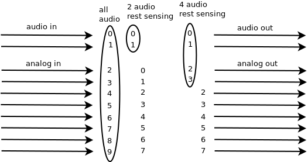

This code will build on Bela image 3.0 and above (requires libbela and xenomai 3).
======================================

See [SuperCollider-on-Bela](https://github.com/BelaPlatform/Bela/wiki/SuperCollider-on-Bela) for general information on SuperCollider on Bela.

Compiling SuperCollider scsynth on Bela
=======================================

See [README.md](README.md) for the main SuperCollider readme.

This file is Dan's, Marije's and Giulio's notes about compiling SC on [Bela](http://bela.io) platform.

This branch contains that plus other modifications to get the SC source code master branch building.
The main addition in this branch is a **Xenomai/Bela audio driver for scsynth**, to use Bela's ultra-low-latency audio thread *instead* of jack/portaudio, and **plugins to access the analog and digital channels of the Bela-cape**

> *NOTE:* This guide assumes you have the [Bela image v0.3.0](https://github.com/BelaPlatform/bela-image-builder/releases/tag/v0.3.0) or later.

> *NOTE:* You need to get the latest version of the Bela code in order for Supercollider to compile.

All of the commands here are to be executed *on the Bela device itself*. Normally you would SSH to it from a computer connected by USB, in order to do the following stuff.

Preparation
===========

Make sure the system time on the board is up to date. This is ensured by simply opening the Bela IDE in a web browser and loading the page, or from the console, if the board is connected to the internet:

    dpkg-reconfigure tzdata
    ntpdate pool.ntp.org
    date  # make sure this gives the right result

or from the console, if the board is NOT connected to the internet, running from the host something like 

	ssh -tt -o StrictHostKeyChecking=no -o ConnectTimeout=5 root@192.168.7.2 "sudo date -s \"`date '+%Y%m%d %T %z'`\""

Get the source code
===================

My modified source code is in this git branch here. If your Bela is connected to the network you can grab it directly:

    cd ~/
    git clone --recursive -b bela https://github.com/BelaPlatform/supercollider.git
    cd supercollider

Otherwise, `git clone` it on your computer and `scp` it over.

### On Bela image v0.2.x(Debian Wheezy):

This version of Supercollider will not compile on this image. Please update your image: https://github.com/BelaPlatform/bela-image-builder/releases

### On Bela image v0.3.x(Debian Stretch):

Before we compile, here are two optional steps to make your workflow faster

1. installing `ccache` makes repeated builds faster, if you have spare disk space for it. It's especially helpful if you're going to be changing the cmake build scripts.

```
apt-get install ccache # requires internet access
mkdir /root/.ccache
echo "cache_dir = '/extrabela/ccache'" >> ~/.ccache/ccache.conf
```

2. alternatively, use `distcc` to make all your builds faster by off-loading the actual compilation to your host computer. You need to:
* install a cross-compiler for gcc-6.3 or clang 3.9 on your host (e.g.: [this](http://files.bela.io/gcc/arm-bela-linux-gnueabihf.zip) or download clang 3.9 from the LLVM website for Mac or a `g++-6.3-arm-linux-gnueabihf` package for your Linux distro).
* then follow instructions here to setup a working distcc environment https://forum.bela.io/d/724-distcc-distributed-compilation-with-bela
* on the host, launch `distccd` with something like `distccd --verbose --no-detach --daemon --allow 192.168.7.2 --log-level error --log-file ~/distccd.log` (and then `tail ~/distccd.log` for errors)
* if you get an error during compilation where it cannot find some stdlib includes (e.g.: `#include <chrono>`), it may well be that `cmake` is trying to force `clang` to use `libc++` (with `-stdlib=libc++`). You can override this by editing your distcc-... executable and adding `-stdlib=libstdc++` at the end of the `$@` line.
* then on the board run the following before the `cmake` commands below:

```
export DISTCC_HOSTS="192.168.7.1"
export CC="distcc-clang" # or other as appropriate, see forum post above
export CXX="distcc-clang++" # or other as appropriate, see forum post above
```

NOTE: make sure you don't pass `-march=native` to the compiler when using `distcc`, or it will compile natively. Therefore, make sure you do NOT pass `-DNATIVE=ON` to `cmake`, as per below

Then here's how to build:

    mkdir ~/supercollider/build
    cd ~/supercollider/build

    # here's the command WITHOUT ccache
    cmake .. -DCMAKE_C_COMPILER=clang -DCMAKE_CXX_COMPILER=clang++ -DNOVA_SIMD=ON -DSSE=OFF -DSSE2=OFF -DINSTALL_HELP=OFF -DNO_X11=ON -DSC_QT=OFF -DSC_IDE=OFF -DSC_EL=OFF -DSC_ED=OFF -DSC_VIM=OFF -DSC_HIDAPI=OFF -DSUPERNOVA=OFF -DNO_AVAHI=ON -DNATIVE=ON -DENABLE_TESTSUITE=OFF -DAUDIOAPI=bela

    # or here's the command WITH ccache
    cmake .. -DCMAKE_C_COMPILER=/usr/lib/ccache/clang -DCMAKE_CXX_COMPILER=/usr/lib/ccache/clang-3.9 -DNOVA_SIMD=ON -DSSE=OFF -DSSE2=OFF -DNO_X11=ON -DINSTALL_HELP=OFF -DSC_QT=OFF -DSC_IDE=OFF -DSC_EL=OFF -DSC_ED=OFF -DSC_VIM=OFF -DSC_HIDAPI=OFF -DSUPERNOVA=OFF -DNO_AVAHI=ON -DNATIVE=ON -DENABLE_TESTSUITE=OFF -DAUDIOAPI=bela

	# or here's the command WITH distcc (it will infer the compilers from the `export CC CXX` above
    cmake .. -DNOVA_SIMD=ON -DSSE=OFF -DSSE2=OFF -DNO_X11=ON -DINSTALL_HELP=OFF -DSC_QT=OFF -DSC_IDE=OFF -DSC_EL=OFF -DSC_ED=OFF -DSC_VIM=OFF -DSC_HIDAPI=OFF -DSUPERNOVA=OFF -DNO_AVAHI=ON -DENABLE_TESTSUITE=OFF -DAUDIOAPI=bela
    make

The `make` step will take a little while, about 30 minutes when using plain `gcc` or `ccache` (you can try `make -j2` or `make -j3` with `distcc`), more like 10 minutes when using `distcc`. It seems it is stuck for a long time at compiling the `BinaryOpUGens.cpp`, but it will get past that.

Next we install:

    make install


Running it
==========

Just run the executable like this:

       scsynth -u 57110 -z 16

The `-u` flag tells it which UDP port to listen on, and with the `-z` flag we choose scsynth's internal blocksize. We need to do this because scsynth's default internal buffer size (64) is bigger than the hardware buffer size (16), so dividing hardware by internal returned 0 buffers per callback. To make it run, you need to add the command-line argument "-z 16" (or presumably make the hardware buffer size bigger).

So now you should have scsynth running on the device. You should be able to send OSC commands to it from SuperCollider running on your main computer:

    // These commands are to be run in SUPERCOLLIDER running on your MAIN computer. (I guess you could run them on the device too if you wanted.)
    Server.default = s = Server("belaServer", NetAddr("192.168.7.2", 57110));
    s.initTree;
    s.startAliveThread;
    SynthDef("funsound", { Out.ar(0, 0.5 * Pan2.ar(SinOsc.ar(LFNoise1.kr(2).exprange(100, 1000)), LFNoise1.kr(2))) }).add;
    x = Synth("funsound");
    SynthDef("bish", { Out.ar(0, PinkNoise.ar * EnvGen.ar(Env.perc, Impulse.kr(2))) }).add;
    y = Synth("bish");
    
    // then when you want to stop the sounds:
    x.free;
    y.free;

    // You could use this to test mic input - be careful of feedback!
    SynthDef("mic", { Out.ar(0, SoundIn.ar([0,1])) }).add;
    z = Synth("mic");
    z.free;
    
BELA I/O's
==========

I/O support for the Bela is implemented.

The startup flag ```-J``` defines how many analog input channels will be enabled, the startup flag ```-K``` how many analog output channels will be enabled, the startup flag ```-G``` how many digital channels will be enabled; by default all are set to 0.

So for all analog and digital channels to be enabled run scsynth like this:

       scsynth -u 57110 -z 16 -J 8 -K 8 -G 16

To use the analog channels all as audio I/O 

       scsynth -u 57110 -z 16 -J 8 -K 8 -G 16 -i 10 -o 10

This will start scsynth with 10 inputs and outputs, inputs/outputs 2 - 9 are the analog pins

To use the analog channels all via the UGens only:

       scsynth -u 57110 -z 16 -J 8 -K 8 -G 16 -i 2 -o 2
       
This will start scsynth with 2 audio inputs and outputs, the analog I/O will only be accessible through UGens, but are all enabled.

If you want higher sample rates of the analog I/O, you can set the number of channels to 4; the number of available channels is then 4.

       scsynth -u 57110 -z 16 -J 4 -K 4 -G 16 -i 2 -o 2

The amount of analog inputs and outputs actually used will be rounded to a multiple of 4, so the actual options are 0, 4 or 8 analog channels. This is because in SuperCollider we cannot sample the analog channels faster than audio rate (right now).



The ```ServerOptions``` class has appropriate variables to set the command line arguments, so you can set them with (but also see the comment below):

    s.options.numAnalogInChannels = 8;
    s.options.numAnalogOutChannels = 8;
    s.options.numDigitalChannels = 16;


The UGens ```AnalogIn```, ```AnalogOut```, ```DigitalIn```, ```DigitalOut```, ```DigitalIO``` give access to the pins; they all have helpfiles with examples of usage.


Examples
======================================================

Example files are available in the folder ```examples/bela```, and will be installed to ```/usr/local/share/SuperCollider/examples/bela```.


Running scsynth *and* sclang
======================================================

You can start the server as normal from the language. To set the settings for the analog I/O you should set them to some reasonable values. The defaults are to not pass the flags to scsynth.

    s = Server.default;

    s.options.numAnalogInChannels = 8;
    s.options.numAnalogOutChannels = 8;
    s.options.numDigitalChannels = 16;

    s.options.blockSize = 16;
    s.options.numInputBusChannels = 2;
    s.options.numOutputBusChannels = 2;
    
    s.waitForBoot({
        "THE SERVER IS BOOTED! Start of my actually interesting code".postln;
    });

Alternatively, you can start scsynth manually, and then connect to it from a separate instance of sclang.

So make one connection and start scsynth:

    scsynth -u 57110 -z 16 -J 8 -K 8 -G 16 -i 2 -o 2

And another to start sclang:

    sclang examples/bela/bela_example_analogin_2.scd
    
Options Overview
----------------------------

Here is a breakdown of the options for running *scsynth* and how to set them up with either *scsynth* or *sclang*

<table>
<tr>
<th>param</th>
<th>scsynth</th>
<th>sclang</th>
</tr>
<tr>
<td>audio computation block size</td>
<td>-z #</td> 
<td> s.options.blockSize = 16;</td>
</tr>
<tr>
<td>number analog input channels enabled [0, 4, 8]</td>
<td>-J #</td>
<td>s.options.numAnalogInChannels = 0;</td>
</tr>
<tr>
<td>number analog output channels enabled [0, 4, 8]</td>
<td>-K #</td>
<td>s.options.numAnalogOutChannels = 0;</td>
</tr>
<tr>
<td>number digital channels enabled</td>
<td>-G #</td>
<td>s.options.numDigitalChannels = 16;</td>
</tr>
<tr>
<td>number of input buffer channels</td>
<td>-i #</td>
<td>s.options.numInputBusChannels = 2;</td>
</tr>
<tr>
<td>number of output buffer channels</td>
<td>-o #</td>
<td>s.options.numOutputBusChannels = 2;</td>
</tr>
</table>


Monitoring its performance
======================================================
Here's a tip on how to check CPU load and "mode switches" for the running program, to make sure it's running properly in realtime etc. (A "mode switch" is something to be avoided: it means the code is dropping out of the Xenomai real-time execution and into normal Linux mode, which can be caused by certain operations in the realtime thread.)

    watch -n 0.5 cat /proc/xenomai/sched/stat

which produces output like:

<pre>
Every 0.5s: cat /proc/xenomai/sched/stat                                                                                                               bela: Fri Jan 11 00:39:12 2019

CPU  PID    MSW        CSW        XSC        PF    STAT       %CPU  NAME
  0  0      0          835043     0          0     00018000   79.0  [ROOT]
  0  14390  5          5          14         1     000480c0    0.0  scsynth
  0  14404  34655      69562      69517      0     00048042    4.4  mAudioSyncSignalTask
  0  14405  1          69782      104649     0     00048046   14.3  bela-audio
  0  0      0          744555     0          0     00000000    0.8  [IRQ16: [timer]]
  0  0      0          34899      0          0     00000000    1.0  [IRQ181: rtdm_pruss_irq_irq]
</pre>

the "MSW" column indicates mode switches; this number should NEVER increase in the bela-audio thread. It is fine if it increases on a task that runs occasionally, but keep in mind that each mode switch carries an additional overhead.

Optional: Bonus level: Even more plugins (sc3-plugins)
======================================================

SuperCollider comes with a built-in set of UGen plugins but there's an extra set in the community **sc3-plugins** project. So if you want, you can also install those:

    cd /extrabela
    git clone --recursive https://github.com/supercollider/sc3-plugins.git
    cd sc3-plugins
    mkdir build
    cd build
    cmake -DSC_PATH=~/supercollider -DCMAKE_C_COMPILER=/usr/lib/ccache/gcc-4.8 -DCMAKE_CXX_COMPILER=/usr/lib/ccache/g++-4.8 -DCMAKE_C_FLAGS="-march=armv7-a -mtune=cortex-a8 -mfloat-abi=hard -mfpu=neon -O2" -DCMAKE_CPP_FLAGS="-march=armv7-a -mtune=cortex-a8 -mfloat-abi=hard -mfpu=neon -O2" ..
    make
    make install

These are basically just the instructions from the README of [the sc3-plugins project](https://github.com/supercollider/sc3-plugins/).
